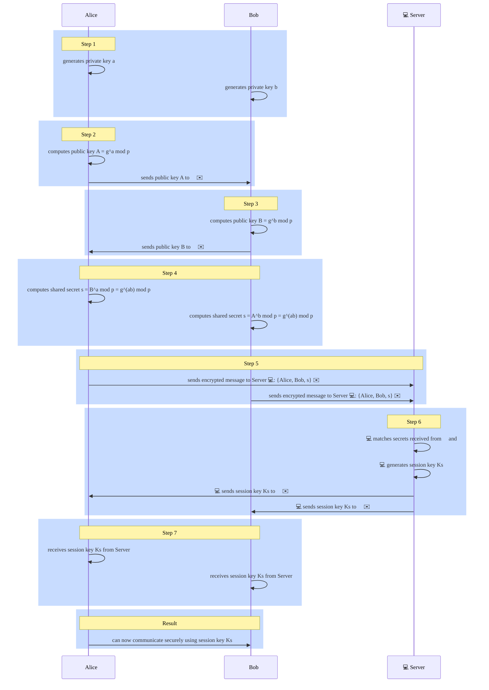

```mermaid
%%{init: {'themeVariables': {'fontFamily': 'Bernard MT Condensed', 'fontSize': '24px','fontWeight': 'bold'}}}%%
sequenceDiagram
    participant Alice as 👩 Alice
    participant Bob as 👨 Bob
    participant Server as 💻 Server

    rect rgb(200, 220, 255)
        note over Alice: Step 1
        Alice ->> Alice: 👩 generates private key a 🔐
        Bob ->> Bob: 👨 generates private key b 🔐
    end

    rect rgb(200, 220, 255)
        note over Alice: Step 2
        Alice ->> Alice: 👩 computes public key A = g^a mod p 🔑
        Alice ->> Bob: 👩 sends public key A to 👨 ✉️
    end

    rect rgb(200, 220, 255)
        note over Bob: Step 3
        Bob ->> Bob: 👨 computes public key B = g^b mod p 🔑
        Bob ->> Alice: 👨 sends public key B to 👩 ✉️
    end

    rect rgb(200, 220, 255)
        note over Alice, Bob: Step 4
        Alice ->> Alice: 👩 computes shared secret s = B^a mod p = g^(ab) mod p 🔐
        Bob ->> Bob: 👨 computes shared secret s = A^b mod p = g^(ab) mod p 🔐
    end

    rect rgb(200, 220, 255)
        note over Alice, Server: Step 5
        Alice ->> Server: 👩 sends encrypted message to Server 💻: {Alice, Bob, s} ✉️
        Bob ->> Server: 👨 sends encrypted message to Server 💻: {Alice, Bob, s} ✉️
    end

    rect rgb(200, 220, 255)
        note over Server: Step 6
        Server ->> Server: 💻 matches secrets received from 👩 and 👨
        Server ->> Server: 💻 generates session key Ks 🔐
        Server ->> Alice: 💻 sends session key Ks to 👩 ✉️
        Server ->> Bob: 💻 sends session key Ks to 👨 ✉️
    end

    rect rgb(200, 220, 255)
        note over Alice, Bob: Step 7
        Alice ->> Alice: 👩 receives session key Ks from Server 🔐
        Bob ->> Bob: 👨 receives session key Ks from Server 🔐
    end

    rect rgb(200, 220, 255)
        note over Alice, Bob: Result
        Alice ->> Bob: 👩 👨 can now communicate securely using session key Ks 🔐
    end
```
