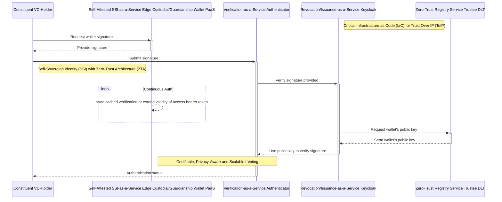

<!--
### Hi there 👋
**c6ai/c6ai** is a ✨ _special_ ✨ repository because its `README.md` (this file) appears on the GitHub profile.
-->

## 1stWallet Sequence Diagram v240224a:

```mermaid
sequenceDiagram
    participant A as Constituent VC-Holder
    participant B as Self-Attested SSI-as-a-Service Edge Custodial/Guardianship Wallet PaaS
    participant C as Verification-as-a-Service Authenticator
    participant D as Revocation/Issuance-as-a-Service Keycloak
    participant E as Zero-Trust Registry Service Trustee DLT
	actor A
    Note right of D: Critical Infrastructure as Code (IaC) for Trust Over IP (ToIP)
    A->>+B: Request wallet signature
    B-->>-A: Provide signature
    A->>+C: Submit signature
    Note right of A: Self-Sovereign Identity (SSI) with Zero-Trust Architecture (ZTA)
    C->>+D: Verify signature provided
    loop Continuous Auth
        B-->>B: sync cached verification or extend validity of access bearer token
    end
    D->>+E: Request wallet's public key
    E-->>-D: Send wallet's public key
    D-->>-C: Use public key to verify signature
    Note right of B: Certifiable, Privacy-Aware and Scalable i-Voting
    C-->>-A: Authentication status
```
